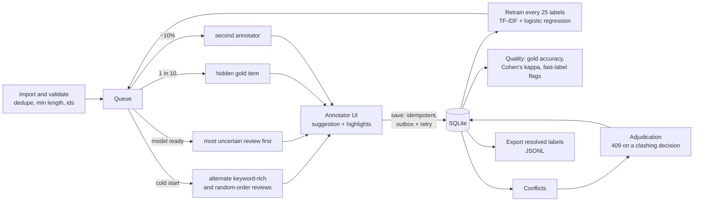

# Labeling workbench: architecture and design choices

## The problem and who it is for

Every ClinIQ result so far rests on proxy labels: a keyword rule on each review's condition field. They
made the benchmarks possible, and they cap what those benchmarks can mean. The workbench exists to replace
them with human labels at the lowest labeling cost, without giving up label quality.

- **Annotators** (clinical reviewers or trained students) label reviews quickly, with a model suggestion when
  it helps.
- **A lead reviewer** resolves disagreements and watches annotator quality.
- **The ML engineer** exports resolved labels to train and evaluate models, and wants every label to be
  trustworthy and traceable.

## Flow

A label reaches the export only when it's resolved: adjudicated, or unanimous among the people who labeled
it. Gold items never train the model and never leave in the export.

## Components

| Piece | File | Role |
|---|---|---|
| Queue, quality, adjudication, export | `labeling/workbench.py` | One SQLite store; all reads and writes under one lock |
| Active learning | `labeling/active_learning.py` | Uncertainty ranking; the simulation behind the 1,500 vs. 11,000 result |
| API | `labeling/server.py` | FastAPI; 422 for bad input, 409 with the stored state for conflicts |
| UI | `labeling/ui/` | React + TypeScript; keyboard-first; on-device outbox for unsaved labels |
| Pilot | `labeling/pilot.py` | Assisted vs. manual comparison with server-chosen conditions |
| Load check | `labeling/benchmark.py` | 46,296 reviews in a SQLite file; latency per call |

**Data model:**
- `items`: text, drug, gold label, overlap flag.
- `labels`: one row per item and annotator, with seconds.
- `label_events`: every label and revision.
- `skips`, `adjudications`.
- `model_runs`: labels, positives and test AP per retrain.

## Design choices and why

1. **Uncertainty sampling, measured by average precision.** The pool is about 6% relevant, so the model learns
   most from reviews near its boundary. In a proxy-label simulation, it reached 95% of full-pool average
   precision with 1,500 labels vs. 11,000 for random sampling. F1 at a fixed 0.5 threshold was rejected as the
   metric: the test set is 50% positive, so small models put almost everything below 0.5, and F1 measured that
   prior shift rather than learning.
2. **Cold start.** Before the model has seen both classes, the queue alternates keyword-rich and random-order
   reviews. This came from using the tool on real reviews: a purely random start can go dozens of items
   without a positive, and no model can train.
3. **Quality is measured, not assumed.**
   - Hidden gold items give per-annotator accuracy (flagged below 80%).
   - Double-labeling gives Cohen's kappa.
   - Labels faster than 2 seconds are flagged.
   - Suggestions can anchor annotators, which is why the pilot compares assisted and manual labeling directly.
4. **Saves are idempotent; conflicts are explicit.**
   - A retried save with the same label is a no-op, so a lost response can't double-count.
   - A different label from the same annotator, or a clashing adjudication, returns 409 with what's stored.
   - Deliberate changes are revisions, logged in `label_events`.
5. **The client never loses a label.** Labels wait in an on-device outbox until the server confirms them.
   Network errors and 5xx are retried with backoff, and leftovers are sent after a reload. New labels are
   blocked while one is unsaved, so the order stays clear.
6. **The server decides pilot conditions.** Which items are assisted can't be changed by the client, so the
   comparison can't be skewed from the browser.
7. **One SQLite connection, one lock.** Simple and fast enough: 12.9 ms at the 95th percentile to fetch the
   next task with 46,296 reviews. Every path must hold the lock, though. Stats and export once read without
   it, and concurrent requests corrupted results under test load. A threaded stress test now fails 5 of 5
   runs without the lock and 0 of 5 with it.

## Testing

- **pytest:**
  - queue order and cold start;
  - gold scoring, agreement, adjudication and export;
  - idempotency, conflicts and revisions;
  - concurrency;
  - pilot counterbalancing.
- **Vitest:** text highlighting, shortcuts, and outbox and retry logic.
- **Playwright on Chromium, Firefox and WebKit, each spec against its own server:**
  - two annotators disagree and a reviewer resolves it;
  - phone layout;
  - response lost after the server stored a label;
  - offline, then reload;
  - 503s past the automatic retries;
  - pilot alternation and counterbalancing.

## What would change at larger scale

- **Postgres instead of SQLite:** row-level locking instead of one process-wide lock, and several server
  workers.
- **Retraining as a background job:** today a retrain adds about 100 ms to one save in 25.
- **Accounts and roles** (annotator, reviewer, admin) instead of typed names; audit of who saw what.
- **Batch selection with diversity:** several annotators at once shouldn't all get near-duplicates of the
  same uncertain review.
- **Calibrated suggestions, and suggestions hidden on gold items,** so gold accuracy measures the annotator,
  not the model.

## The same pattern for images

The surgical video project (`vajja1405/SS-SD`) applies the same loop to bounding boxes:
- A projection learned from robot kinematics pre-labels each instrument.
- Saves are versioned, so a stale tab gets a 409 instead of overwriting.
- An A/B mode hides pre-labels on alternate frames to measure their accuracy without anchoring.

See `annotation_ui/` and the "Instrument box annotation" section of that README.
